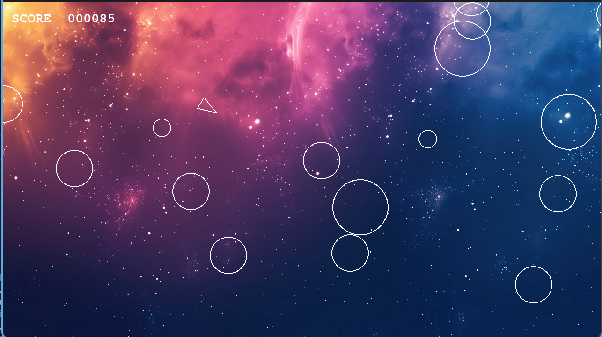

# Asteroids

A classic Asteroids clone built with Python and pygame.

## Gameplay

Use **WASD** to fly and **Space** to shoot. Destroy asteroids before they destroy you!



## Setup

```bash
uv run main.py
```

## Controls

| Key       | Action        |
|-----------|---------------|
| W / S     | Thrust forward / back |
| A / D     | Rotate left / right   |
| Space     | Shoot                 |
| Q         | Quit (game over screen) |
